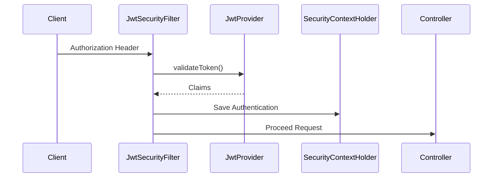
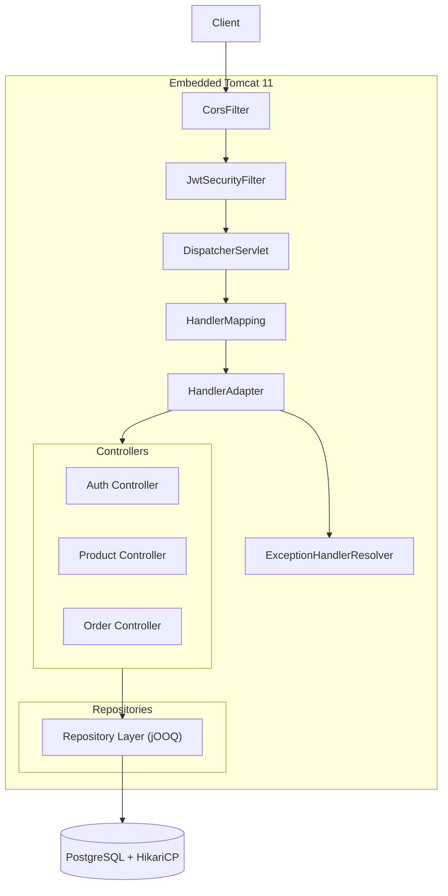
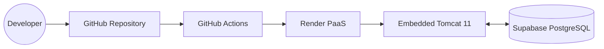
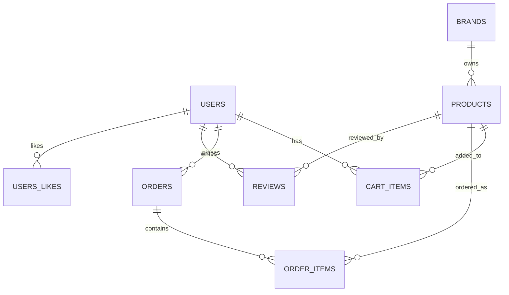

<div align="center">


<a id="top"></a>

# ⚙️ FITORY BACKEND

### High Performance Fashion Commerce API

### powered by Custom MVC Framework **Xpring**

<br/>


<br/><br/>

<table>
<tr>
<td align="center" width="260">

### ⚙️ Custom MVC

DispatcherServlet  
HandlerMapping  
IoC Container

</td>

<td align="center" width="260">

### 🛡 Stateless Security

JWT Authentication  
Security Filter  
ThreadLocal Context

</td>

<td align="center" width="260">

### 🚀 SQL Optimization

jOOQ Type Safety  
pg_trgm Search  
Batch Insert

</td>
</tr>
</table>

<br/>

외부 프레임워크 의존성을 배제하고  
순수 Java 기반으로 직접 구현한 MVC 프레임워크 **Xpring** 위에서 동작하는  
고성능 패션 커머스 API 서버입니다.

<br/>

> Compile-Time Type Safety · Layered Architecture · Embedded Tomcat · Stateless Authentication

</div>

---

# 📚 Table of Contents

- [👨‍💻 Team & Contributions](#-team--contributions)
- [🏗 Framework: Xpring](#-framework-xpring)
- [🧠 Core Logic](#-core-logic)
- [🏛 Architecture & Request Flow](#-architecture--request-flow)
- [🚀 CI/CD & Deployment Architecture](#-cicd--deployment-architecture)
- [🗄 Entity-Relationship Diagram (ERD)](#-entity-relationship-diagram-erd)
- [🛠 Infrastructure Design Justification](#-infrastructure-design-justification)
- [🔥 Engineering Challenge & Troubleshooting](#-engineering-challenge--troubleshooting)
- [📄 API Documentation](#-api-documentation)
- [📂 Project Structure](#-project-structure)
- [⚙️ Environment Variables](#️-environment-variables)
- [🚀 Build & Run](#-build--run)
- [🗃 Database](#-database)
- [🔄 CI / CD](#-ci--cd)

---

# 👨‍💻 Team & Contributions

계층(Layer)과 도메인을 명확히 분리하여 각 팀원이 핵심 기능을 전담했습니다.

<table>
<tr>
<td align="center" width="180px">

<a href="https://github.com/chan-nni">

</a>

### 👑 강찬미

</td>

<td>

### 🛡️ Security & 📦 Order

- JWT 기반 Stateless 인증 아키텍처 설계
- Security Filter 및 인증 컨텍스트 구현
- jOOQ 기반 주문 트랜잭션 및 페이징 처리
- Batch Insert 기반 주문 성능 최적화

</td>
</tr>

<tr>
<td align="center" width="180px">

<a href="https://github.com/yyubin">

</a>

### 💻 박유빈

</td>

<td>

### ⚙️ Framework & Core Domains

- Xpring MVC Framework 자체 구현
- DispatcherServlet · IoC Container 설계
- 리뷰 · 좋아요 · 카테고리 도메인 구현

</td>
</tr>

<tr>
<td align="center" width="180px">

<a href="https://github.com/dh0250">

</a>

### 🛒 한다현

</td>

<td>

### 🛍 Product & Cart

- 장바구니 상태 동기화 및 수량 제어
- pg_trgm 기반 상품 검색 최적화
- 상품 검색 및 큐레이션 API 구현

</td>
</tr>
</table>

<div align="right">

[🔝 Back to Top](#top)

</div>

---

# 🏗 Framework: Xpring

Spring 없이 순수 Java 리플렉션과 서블릿을 활용하여 직접 구현한 웹 프레임워크입니다.

| Component | Description |
|---|---|
| `DispatcherServlet` | Front Controller |
| `HandlerMapping` | Regex 기반 라우팅 |
| `HandlerAdapter` | Argument Resolver |
| `BeanFactory` | Reflection 기반 IoC Container |
| `ExceptionHandlerResolver` | 전역 예외 처리 |

<br>

### 🎯 Framework Goal

- HTTP 요청 흐름 직접 제어
- Reflection 기반 DI 구조 구현
- Front Controller 패턴 직접 설계
- MVC 내부 동작 원리 이해

<div align="right">

[🔝 Back to Top](#top)

</div>

---

# 🧠 Core Logic

프로젝트의 핵심 아키텍처 및 성능 최적화 로직입니다.

## 🔐 JWT Stateless Authentication

담당: **강찬미 (Security)**

세션 기반 인증 대신 JWT 기반 상태 비저장(Stateless) 인증 구조를 직접 구현했습니다.

### 핵심 흐름



### 핵심 포인트

- `SecurityFilter` 기반 인증 처리
- `ThreadLocal SecurityContext` 활용
- JWT 만료 검증 및 사용자 인증 객체 생성
- MVC Layer와 인증 책임 완전 분리

```java
if (jwtProvider.validateToken(token)) {

    Claims claims = jwtProvider.parseClaims(token);

    Long userId = Long.parseLong(claims.getSubject());

    Optional<User> userOpt = userRepository.findById(userId);

    if (userOpt.isPresent()) {
        return new JwtAuthentication(userOpt.get());
    }
}
```

---

## ⚡ Batch Insert 기반 주문 처리 최적화

담당: **강찬미 (Order)**

여러 개의 주문 상품(OrderItem)을 Batch Insert 기반으로 처리하여 DB I/O 비용을 최소화했습니다.

```java
dsl.batch(
    orderItems.stream()
        .map(item ->
            dsl.insertInto(ORDER_ITEMS)
        )
        .toList()
).execute();
```

### 적용 효과

- DB Round Trip 감소
- 주문 처리 성능 개선
- 트랜잭션 효율 향상

---

## 🔍 PostgreSQL pg_trgm 검색 최적화

담당: **한다현 (Product & Cart)**

`LIKE '%keyword%'` 검색 성능 문제를 해결하기 위해 `pg_trgm + GIN Index` 기반 검색 최적화를 적용했습니다.

```sql
CREATE EXTENSION IF NOT EXISTS pg_trgm;

CREATE INDEX idx_products_name_trgm
ON products
USING gin(name gin_trgm_ops);
```

### 적용 효과

- Sequential Scan 제거
- 검색 속도 개선
- 대용량 상품 검색 최적화

---

## ⚙️ Custom MVC Framework

담당: **박유빈 (Framework & Core)**

Spring 없이 순수 Java 기반 MVC Framework를 직접 구현했습니다.

| Component | Description |
|---|---|
| `DispatcherServlet` | Front Controller |
| `HandlerMapping` | Regex Routing |
| `HandlerAdapter` | Argument Resolver |
| `BeanFactory` | IoC Container |

<div align="right">

[🔝 Back to Top](#top)

</div>

---

# 🏛 Architecture & Request Flow



<div align="right">

[🔝 Back to Top](#top)

</div>

---

# 🚀 CI/CD & Deployment Architecture



<div align="right">

[🔝 Back to Top](#top)

</div>

---

# 🗄 Entity-Relationship Diagram (ERD)



<div align="right">

[🔝 Back to Top](#top)

</div>

---

# 🛠 Infrastructure Design Justification

## 🐘 PostgreSQL

- CHECK Constraint 기반 데이터 정합성 보장
- `pg_trgm` 기반 상품 검색 최적화
- 대용량 데이터 처리에 적합한 RDBMS 구조

---

## ⚡ jOOQ

- Compile-Time Type Safety
- SQL 중심 추상화
- DB 스키마 기반 코드 생성

---

## 🔐 JWT Authentication

- Stateless 인증 구조
- Filter 기반 인증 처리
- ThreadLocal Security Context 관리

<div align="right">

[🔝 Back to Top](#top)

</div>

---

# 🔥 Engineering Challenge & Troubleshooting

## 🚨 PostgreSQL Constraint와 Java Enum 불일치 해결

담당: **강찬미 (Security & Order)**

### 문제 상황

DB는 소문자 상태값을 요구하지만 Java Enum은 대문자 기반으로 동작하여 제약조건 충돌이 발생했습니다.

### 해결 방식

Repository Layer 내부에서 데이터 변환 로직을 캡슐화하여 해결했습니다.

```java
.set(field("status"),
     order.getStatus().name().toLowerCase())

.status(OrderStatus.valueOf(
    record.get("status", String.class).toUpperCase()
))
```

### 결과

- DB 정책과 도메인 정책 완전 분리
- Layered Architecture 유지
- 도메인 순수성 보장

---

## 🚨 Framework 내부 구조 개선

담당: **박유빈 (Framework & Core)**

- DispatcherServlet 구조 개선 예정
- Regex Routing 최적화 예정
- IoC Container 개선 예정

---

## 🚨 상품 검색 성능 최적화

담당: **한다현 (Product & Cart)**

- 상품 검색 인덱싱 전략 개선
- 검색 응답 속도 최적화
- 페이징 처리 개선 예정

<div align="right">

[🔝 Back to Top](#top)

</div>

---

# 📄 API Documentation

> 🔒 표시는 `Authorization: Bearer <token>` 헤더가 필요한 API입니다.

---

## 🔐 Auth & Users

| Method | Endpoint | Description |
|---|---|---|
| POST | `/api/tokens` | 사용자 로그인 및 JWT 발급 |
| POST | `/api/users` | 신규 회원가입 |
| GET | `/api/users/me` | 내 정보 조회 🔒 |

---

## 🛒 Products

| Method | Endpoint | Description |
|---|---|---|
| GET | `/api/products` | 전체 상품 목록 |
| GET | `/api/products/search` | 상품 검색 |
| GET | `/api/products/new-arrivals` | 신상품 목록 |
| GET | `/api/products/ranks` | 인기 상품 목록 |
| GET | `/api/products/{id}` | 상품 상세 조회 |
| POST | `/api/products` | 상품 등록 |
| PUT | `/api/products/{id}` | 상품 수정 |
| DELETE | `/api/products/{id}` | 상품 삭제 |
| GET | `/api/products/{productId}/reviews` | 특정 상품 리뷰 조회 |

---

## 🏷 Brands & Categories

| Method | Endpoint | Description |
|---|---|---|
| GET | `/api/brands` | 브랜드 목록 |
| GET | `/api/brands/{id}` | 브랜드 상세 |
| GET | `/api/brands/{id}/products` | 브랜드 상품 목록 |
| GET | `/api/categories` | 카테고리 목록 |

---

## 🛒 Cart 🔒

| Method | Endpoint | Description |
|---|---|---|
| GET | `/api/carts` | 내 장바구니 조회 |
| POST | `/api/carts` | 장바구니 담기 |
| PATCH | `/api/carts/{id}` | 장바구니 수량 변경 |
| DELETE | `/api/carts/{id}` | 개별 항목 삭제 |
| DELETE | `/api/carts` | 장바구니 전체 비우기 |

---

## 📦 Orders 🔒

| Method | Endpoint | Description |
|---|---|---|
| GET | `/api/orders` | 주문 목록 조회 |
| GET | `/api/orders/{orderId}/items` | 주문 상세 조회 |
| POST | `/api/orders` | 주문 생성 |

---

## 💬 Reviews & Likes 🔒

| Method | Endpoint | Description |
|---|---|---|
| GET | `/api/reviews` | 리뷰 목록 조회 |
| GET | `/api/reviews/{id}` | 리뷰 상세 조회 |
| POST | `/api/reviews` | 리뷰 작성 |
| PUT | `/api/reviews/{id}` | 리뷰 수정 |
| DELETE | `/api/reviews/{id}` | 리뷰 삭제 |
| GET | `/api/likes` | 위시리스트 조회 |
| GET | `/api/likes/products/{productId}` | 상품 좋아요 조회 |
| POST | `/api/likes` | 위시리스트 추가 |
| DELETE | `/api/likes?productId={productId}` | 위시리스트 삭제 |

---

## 🚨 Error Responses

| HTTP | Description |
|---|---|
| `400` | Bad Request |
| `401` | Unauthorized |
| `404` | Not Found |
| `409` | Conflict |
| `500` | Internal Server Error |

```json
{
  "code": "NOT_FOUND",
  "message": "상품을 찾을 수 없습니다."
}
```

<div align="right">

[🔝 Back to Top](#top)

</div>

---

# 📂 Project Structure

```text
backend/
├── src/main/java/org/fitory/
│   ├── auth/
│   ├── brand/
│   ├── cart/
│   ├── category/
│   ├── common/
│   ├── exception/
│   ├── order/
│   ├── product/
│   ├── review/
│   ├── security/
│   ├── user/
│   └── userlike/
│
├── src/main/resources/
│   ├── application.yml
│   └── migration/
│
└── xpring/
    ├── boot/
    ├── core/
    ├── mvc/
    ├── log/
    └── security/
```

<div align="right">

[🔝 Back to Top](#top)

</div>

---

# ⚙️ Environment Variables

| Variable | Description |
|---|---|
| `DATABASE_URL` | PostgreSQL JDBC URL |
| `DATABASE_USERNAME` | DB Username |
| `DATABASE_PASSWORD` | DB Password |
| `JWT_SECRET_KEY` | JWT Secret Key |
| `CORS` | Allowed Frontend Origin |

<div align="right">

[🔝 Back to Top](#top)

</div>

---

# 🚀 Build & Run

## Build

```bash
./gradlew shadowJar
```

---

## Run

```bash
export DATABASE_URL=jdbc:postgresql://localhost:5432/fitory
export DATABASE_USERNAME=postgres
export DATABASE_PASSWORD=yourpassword
export JWT_SECRET_KEY=your-base64-secret
export CORS=http://localhost:3000

java -jar build/libs/fitory.jar
```

---

## Docker

```bash
docker build -t fitory-backend:latest .

docker run -p 8080:8080 \
    -e DATABASE_URL=jdbc:postgresql://db:5432/fitory \
    -e DATABASE_USERNAME=postgres \
    -e DATABASE_PASSWORD=yourpassword \
    -e JWT_SECRET_KEY=your-base64-secret \
    -e CORS=http://localhost:3000 \

fitory-backend:latest
```

<div align="right">

[🔝 Back to Top](#top)

</div>

---

# 🗃 Database

```sql
CREATE EXTENSION IF NOT EXISTS pg_trgm;
```

| Table | Description |
|---|---|
| `users` | 회원 계정 |
| `products` | 상품 |
| `orders` | 주문 |
| `reviews` | 리뷰 |
| `users_likes` | 좋아요 |

<div align="right">

[🔝 Back to Top](#top)

</div>

---

# 🔄 CI / CD

| Event | Action |
|---|---|
| `v*` Tag Push | Render Deploy Trigger |

```bash
git tag v1.0.0
git push origin v1.0.0
```

<div align="center">

<br><br>

# 🚀 FITORY BACKEND

### Custom MVC Framework · Stateless Authentication · High Performance SQL Architecture

<br>

[🔝 Back to Top](#top)


</div>
