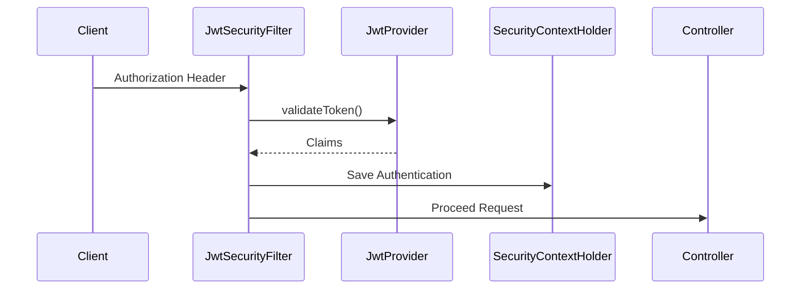
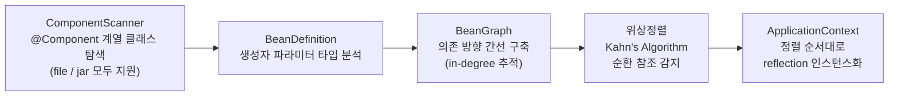
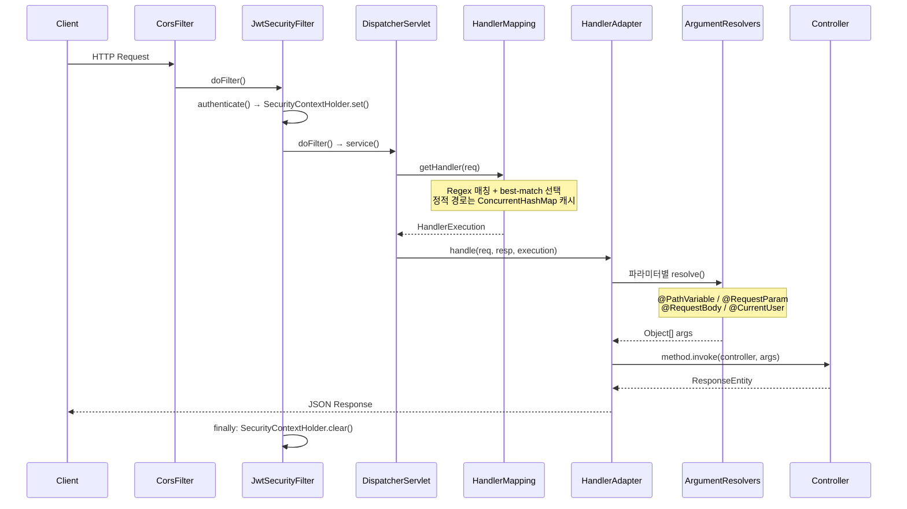
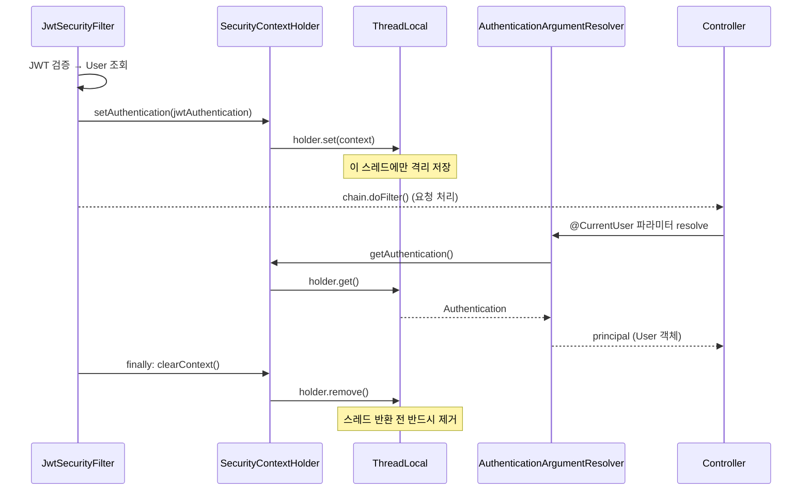
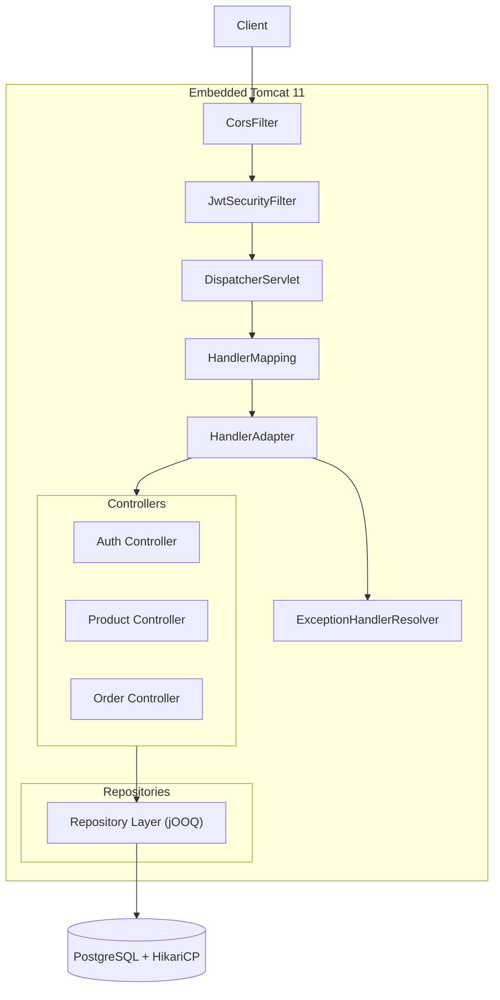
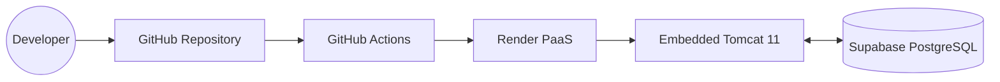
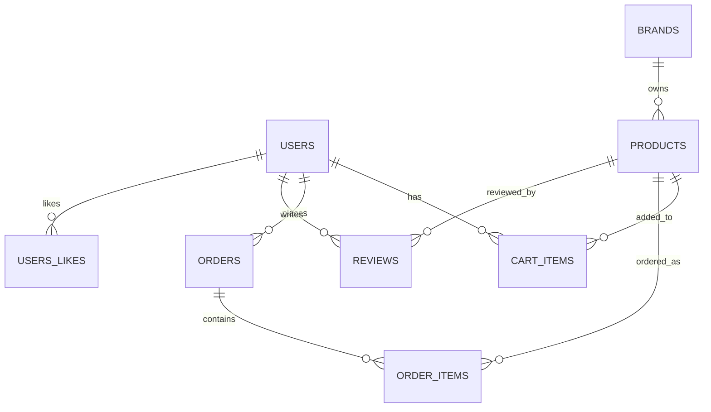

<div align="center">


<a id="top"></a>

# ⚙️ FITORY BACKEND

### High Performance Fashion Commerce API

### powered by Custom MVC Framework **Xpring**

<br/>


<br/><br/>

<table>
<tr>
<td align="center" width="260">

### ⚙️ Custom MVC

DispatcherServlet  
HandlerMapping  
IoC Container

</td>

<td align="center" width="260">

### 🛡 Stateless Security

JWT Authentication  
Security Filter  
ThreadLocal Context

</td>

<td align="center" width="260">

### 🚀 SQL Optimization

jOOQ Type Safety  
pg_trgm Search  
Batch Insert

</td>
</tr>
</table>

<br/>

외부 프레임워크 의존성을 배제하고  
순수 Java 기반으로 직접 구현한 MVC 프레임워크 **Xpring** 위에서 동작하는  
고성능 패션 커머스 API 서버입니다.

<br/>

> Compile-Time Type Safety · Layered Architecture · Embedded Tomcat · Stateless Authentication

</div>

---

# 📚 Table of Contents

- [👨‍💻 Team & Contributions](#-team--contributions)
- [🏗 Framework: Xpring](#-framework-xpring)
- [🧠 Core Logic](#-core-logic)
- [🏛 Architecture & Request Flow](#-architecture--request-flow)
- [🚀 CI/CD & Deployment Architecture](#-cicd--deployment-architecture)
- [🗄 Entity-Relationship Diagram (ERD)](#-entity-relationship-diagram-erd)
- [🛠 Infrastructure Design Justification](#-infrastructure-design-justification)
- [🔥 Engineering Challenge & Troubleshooting](#-engineering-challenge--troubleshooting)
- [📄 API Documentation](#-api-documentation)
- [📂 Project Structure](#-project-structure)
- [⚙️ Environment Variables](#️-environment-variables)
- [🚀 Build & Run](#-build--run)
- [🗃 Database](#-database)
- [🔄 CI / CD](#-ci--cd)

---

# 👨‍💻 Team & Contributions

계층(Layer)과 도메인을 명확히 분리하여 각 팀원이 핵심 기능을 전담했습니다.

<table>
<tr>
<td align="center" width="180px">

<a href="https://github.com/chan-nni">

</a>

### 👑 강찬미

</td>

<td>

### 🛡️ Security & 📦 Order

- JWT 기반 Stateless 인증 아키텍처 설계
- Security Filter 및 인증 컨텍스트 구현
- jOOQ 기반 주문 트랜잭션 및 페이징 처리
- Batch Insert 기반 주문 성능 최적화

</td>
</tr>

<tr>
<td align="center" width="180px">

<a href="https://github.com/yyubin">

</a>

### 💻 박유빈

</td>

<td>

### ⚙️ Framework & Core Domains

- Xpring MVC Framework 자체 구현
- DispatcherServlet · IoC Container 설계
- 리뷰 · 좋아요 · 카테고리 도메인 구현

</td>
</tr>

<tr>
<td align="center" width="180px">

<a href="https://github.com/dh0250">

</a>

### 🛒 한다현

</td>

<td>

### 🛍 Product & Cart

- 장바구니 상태 동기화 및 수량 제어
- pg_trgm 기반 상품 검색 최적화
- 상품 검색 및 큐레이션 API 구현

</td>
</tr>
</table>

<div align="right">

[🔝 Back to Top](#top)

</div>

---

# 🏗 Framework: Xpring

Spring 없이 순수 Java 리플렉션과 서블릿을 활용하여 직접 구현한 웹 프레임워크입니다.

| Component | Description |
|---|---|
| `DispatcherServlet` | Front Controller |
| `HandlerMapping` | Regex 기반 라우팅 |
| `HandlerAdapter` | Argument Resolver |
| `BeanFactory` | Reflection 기반 IoC Container |
| `ExceptionHandlerResolver` | 전역 예외 처리 |

<br>

### 🎯 Framework Goal

- HTTP 요청 흐름 직접 제어
- Reflection 기반 DI 구조 구현
- Front Controller 패턴 직접 설계
- MVC 내부 동작 원리 이해

<div align="right">

[🔝 Back to Top](#top)

</div>

---

# 🧠 Core Logic

프로젝트의 핵심 아키텍처 및 성능 최적화 로직입니다.

## 🔐 JWT Stateless Authentication

담당: **강찬미 (Security)**

세션 기반 인증 대신 JWT 기반 상태 비저장(Stateless) 인증 구조를 직접 구현했습니다.

### 핵심 흐름



### 핵심 포인트

- `SecurityFilter` 기반 인증 처리
- `ThreadLocal SecurityContext` 활용
- JWT 만료 검증 및 사용자 인증 객체 생성
- MVC Layer와 인증 책임 완전 분리

```java
if (jwtProvider.validateToken(token)) {

    Claims claims = jwtProvider.parseClaims(token);

    Long userId = Long.parseLong(claims.getSubject());

    Optional<User> userOpt = userRepository.findById(userId);

    if (userOpt.isPresent()) {
        return new JwtAuthentication(userOpt.get());
    }
}
```

---

## ⚡ Batch Insert 기반 주문 처리 최적화

담당: **강찬미 (Order)**

여러 개의 주문 상품(OrderItem)을 Batch Insert 기반으로 처리하여 DB I/O 비용을 최소화했습니다.

```java
dsl.batch(
    orderItems.stream()
        .map(item ->
            dsl.insertInto(ORDER_ITEMS)
        )
        .toList()
).execute();
```

### 적용 효과

- DB Round Trip 감소
- 주문 처리 성능 개선
- 트랜잭션 효율 향상

---

## 🔍 PostgreSQL pg_trgm 검색 최적화

담당: **한다현 (Product & Cart)**

`LIKE '%keyword%'` 검색 성능 문제를 해결하기 위해 `pg_trgm + GIN Index` 기반 검색 최적화를 적용했습니다.

```sql
CREATE EXTENSION IF NOT EXISTS pg_trgm;

CREATE INDEX idx_products_name_trgm
ON products
USING gin(name gin_trgm_ops);
```

### 적용 효과

- Sequential Scan 제거
- 검색 속도 개선
- 대용량 상품 검색 최적화

---

## 🛒 장바구니 상태 동기화 및 수량 제어

담당: **한다현 (Product & Cart)**

동일 상품의 중복 담기와 수량 변경 시 데이터 정합성을 보장하는 장바구니 상태 관리 로직을 구현했습니다.

### 핵심 포인트

- 장바구니 담기 시 동일 상품 존재 여부를 사전 조회하여 신규 INSERT / 수량 합산 UPDATE 분기 처리
- `PATCH /api/carts/{id}` 로 수량 단독 변경 지원
- 단건 삭제(`DELETE /api/carts/{id}`)와 전체 비우기(`DELETE /api/carts`)를 분리된 엔드포인트로 구현하여 오작동 방지

```java
Optional<CartItem> existing =
    cartRepository.findByUserIdAndProductId(userId, productId);

if (existing.isPresent()) {
    cartRepository.updateQuantity(
        existing.get().getId(),
        existing.get().getQuantity() + request.getQuantity()
    );
} else {
    cartRepository.insert(userId, productId, request.getQuantity());
}
```

---

## ⚙️ IoC Container & 생성자 주입 (위상정렬 기반)

담당: **박유빈 (Framework & Core)**

Spring의 `@Autowired` 없이 순수 리플렉션으로 DI 컨테이너를 구현했습니다.
빈 인스턴스화 순서를 보장하기 위해 의존 그래프를 구축하고 위상정렬(Kahn's Algorithm)로 생성 순서를 결정합니다.

### 동작 흐름



### 핵심 포인트

**① 컴포넌트 스캔** — `@Component`를 메타 어노테이션으로 가진 `@Service`, `@Repository`, `@RestController`도 같이 탐지합니다.

```java
// 메타 어노테이션 체인 탐색
for (Annotation ann : cls.getAnnotations()) {
    if (ann.annotationType().isAnnotationPresent(Component.class)) return true;
}
```

**② 위상정렬로 인스턴스화 순서 결정** — 의존 대상 빈이 먼저 생성되어야 하므로, `BeanGraph`가 생성자 파라미터 타입을 분석해 간선을 구축하고 Kahn's Algorithm으로 정렬합니다. 정렬 후 빈 개수가 노드 수와 다르면 순환 의존성으로 판단해 예외를 던집니다.

```java
// BeanGraph — in-degree 0인 빈부터 큐에 투입
Deque<String> queue = new ArrayDeque<>(zeros);
while (!queue.isEmpty()) {
    String cur = queue.poll();
    ordered.add(nodeMap.get(cur));
    for (String next : dependents) {
        if (indegree.merge(next, -1, Integer::sum) == 0) queue.add(next);
    }
}
if (ordered.size() != nodeMap.size()) throw new CircularDependencyException(...);
```

**③ List\<T\> 주입 지원** — 생성자 파라미터가 `List<T>` 형태이면 `getParameterizedType()`으로 원소 타입을 추출해 해당 타입의 모든 빈을 주입합니다. `HandlerAdapter`의 `List<ArgumentResolver>` 주입이 이 방식으로 동작합니다.

---

## 🌐 내장 Tomcat 요청 처리 파이프라인

담당: **박유빈 (Framework & Core)**

`EmbeddedTomcatServer`가 Tomcat을 직접 초기화하고, Filter 체인과 `DispatcherServlet`을 프로그래밍 방식으로 등록합니다.
Front Controller 패턴으로 모든 요청이 `DispatcherServlet` 하나를 통과합니다.

### 요청 처리 흐름



### 핵심 포인트

**① Filter 등록** — IoC 컨테이너에서 `Filter` 타입 빈을 수집해 Tomcat Context에 순서대로 등록합니다. 필터 추가 시 코드 수정 없이 `@Component`만 붙이면 됩니다.

```java
// XpringApplication — Filter 빈 자동 수집 후 서버에 주입
List<Filter> filters = context.getBeansOfType(Filter.class);
new EmbeddedTomcatServer(dispatcherServlet, filters).start(port);
```

**② HandlerAdapter — ArgumentResolver 체인** — 컨트롤러 메서드의 각 파라미터를 `supports()` 조건에 맞는 `ArgumentResolver`가 담당합니다. 새 파라미터 타입은 `ArgumentResolver` 구현체 하나만 추가하면 됩니다.

```java
// 파라미터마다 지원하는 리졸버를 찾아 순서대로 resolve
ArgumentResolver resolver = argumentResolvers.stream()
    .filter(r -> r.supports(param))
    .findFirst()
    .orElseThrow(...);
args[i] = resolver.resolve(param, req, resp, pathVars);
```

---

## 🔒 ThreadLocal 기반 인증 컨텍스트 전파

담당: **박유빈 (Framework & Core)**

Tomcat은 요청마다 스레드 풀의 스레드를 재사용합니다. `ThreadLocal`을 활용해 인증 정보를 현재 스레드에만 격리 저장하고, 요청이 끝나면 반드시 제거해 컨텍스트 누출을 방지합니다.

### 동작 흐름



### 핵심 포인트

**① SecurityFilter 추상 클래스** — `doFilter()` 안에서 `authenticate()` 호출 → 저장 → `chain.doFilter()` → `finally` 정리를 강제합니다. 구현체(`JwtSecurityFilter`)는 `authenticate()`만 오버라이드하면 됩니다.

```java
// SecurityFilter — try/finally로 정리 보장
try {
    Authentication auth = authenticate(req, resp);
    SecurityContextHolder.setAuthentication(auth);
    chain.doFilter(request, response);
} finally {
    SecurityContextHolder.clearContext(); // 스레드 풀 재사용으로 인한 컨텍스트 누출 방지
}
```

**② 만료 토큰 구분** — 유효하지 않은 토큰과 만료된 토큰을 다르게 처리합니다. 만료 시 request attribute에 플래그를 세팅하고, `AuthenticationArgumentResolver`에서 이를 확인해 `TokenExpiredException`을 던집니다.

```java
// JwtSecurityFilter
if (jwtProvider.isExpired(token)) {
    request.setAttribute("TOKEN_EXPIRED", true); // 만료 플래그
    return null;
}

// AuthenticationArgumentResolver
if (Boolean.TRUE.equals(request.getAttribute("TOKEN_EXPIRED"))) {
    throw new TokenExpiredException(); // 401 + 만료 에러코드
}
throw new UnauthorizedException(); // 401 + 미인증 에러코드
```

**③ `@CurrentUser` ArgumentResolver** — 컨트롤러에서 `SecurityContextHolder`를 직접 참조하지 않고 `@CurrentUser` 어노테이션으로 인증된 사용자 객체를 주입받습니다. MVC 레이어와 보안 레이어의 결합도를 낮춥니다.

```java
// Controller
public ResponseEntity<?> getMe(@CurrentUser User user) { ... }

// AuthenticationArgumentResolver
public Object resolve(Parameter parameter, ...) {
    Authentication auth = SecurityContextHolder.getAuthentication();
    return auth.getPrincipal(); // User 객체 반환
}
```

<div align="right">

[🔝 Back to Top](#top)

</div>

---

# 🏛 Architecture & Request Flow



<div align="right">

[🔝 Back to Top](#top)

</div>

---

# 🚀 CI/CD & Deployment Architecture



<div align="right">

[🔝 Back to Top](#top)

</div>

---

# 🗄 Entity-Relationship Diagram (ERD)



<div align="right">

[🔝 Back to Top](#top)

</div>

---

# 🛠 Infrastructure Design Justification

## 🐘 PostgreSQL

- CHECK Constraint 기반 데이터 정합성 보장
- `pg_trgm` 기반 상품 검색 최적화
- 대용량 데이터 처리에 적합한 RDBMS 구조

---

## ⚡ jOOQ

- Compile-Time Type Safety
- SQL 중심 추상화
- DB 스키마 기반 코드 생성

---

## 🔐 JWT Authentication

- Stateless 인증 구조
- Filter 기반 인증 처리
- ThreadLocal Security Context 관리

<div align="right">

[🔝 Back to Top](#top)

</div>

---

# 🔥 Engineering Challenge & Troubleshooting

## 🚨 PostgreSQL Constraint와 Java Enum 불일치 해결

담당: **강찬미 (Security & Order)**

### 문제 상황

DB는 소문자 상태값을 요구하지만 Java Enum은 대문자 기반으로 동작하여 제약조건 충돌이 발생했습니다.

### 해결 방식

Repository Layer 내부에서 데이터 변환 로직을 캡슐화하여 해결했습니다.

```java
.set(field("status"),
     order.getStatus().name().toLowerCase())

.status(OrderStatus.valueOf(
    record.get("status", String.class).toUpperCase()
))
```

### 결과

- DB 정책과 도메인 정책 완전 분리
- Layered Architecture 유지
- 도메인 순수성 보장

---

## 🚨 정적 경로와 동적 경로 간 라우팅 충돌 해결

담당: **박유빈 (Framework & Core)**

### 문제 상황

`/products/ranks`와 `/products/{id}` 두 핸들러가 공존할 때, 커스텀 프레임워크는 먼저 등록된 핸들러를 반환하는 first-match 방식이었습니다.
`{id}`의 Regex가 `[^/]+`이기 때문에 `ranks`라는 문자열도 매칭되어 `/products/ranks` 요청이 `/products/{id}` 핸들러로 흡수되는 충돌이 발생했습니다.
또한 가변 URI(`/products/123`, `/products/456` …)를 모두 캐시 키로 저장하다 보니 캐시가 무한히 증가하는 메모리 문제도 함께 발견됐습니다.

### 해결 방식

세 단계로 나눠서 해결했습니다.

**① 핸들러 등록 시 사전 정렬**

path variable이 적을수록(= 정적 세그먼트가 많을수록) 구체적인 경로입니다.
같은 variable 개수면 경로 길이가 긴 쪽을 우선시합니다.

```java
handlers.sort(Comparator
    .comparingInt((HandlerMethod h) -> h.getPathVariableNames().size())
    .thenComparingInt(h -> -h.getPathTemplate().length()));
```

**② first-match → best-match 교체**

정렬만으로는 안전하지 않아서, 매칭 루프에서 path variable 개수가 가장 적은 핸들러를 최종 선택하도록 변경했습니다.

```java
HandlerExecution bestMatch = null;
int bestVarCount = Integer.MAX_VALUE;

for (HandlerMethod handler : handlers) {
    if (handler.getHttpMethod() != httpMethod) continue;
    List<String> names = handler.getPathVariableNames();
    if (names.size() >= bestVarCount) continue; // 더 나은 후보만 검사
    Matcher m = handler.getUriPattern().matcher(uri);
    if (m.matches()) {
        bestMatch = new HandlerExecution(handler, pathVars);
        bestVarCount = names.size();
        if (bestVarCount == 0) break; // 정적 경로면 즉시 확정
    }
}
```

**③ path variable 타입 기반 Regex 세분화**

`Long`/`Integer` 파라미터는 `\d+`, 나머지는 `[^/]+`으로 컴파일해 숫자 ID 경로와 문자열 경로가 서로 매칭되지 않도록 했습니다.

```java
// {id: Long}  →  (\d+)
// {slug: String}  →  ([^/]+)
regex.append(isNumericParam(varName, params) ? "(\\d+)" : "([^/]+)");
```

**④ 캐시 키를 정적 경로로 한정**

가변 URI는 캐싱하지 않고 path variable이 없는 경로만 캐싱하여 메모리 문제를 해결했습니다.

```java
if (bestMatch.handler().getPathVariableNames().isEmpty()) {
    routeCache.put(cacheKey, bestMatch);
}
```

### 결과

- 정적 경로(`/products/ranks`)가 동적 경로(`/products/{id}`)보다 항상 우선 매칭
- 라우팅 정확성과 캐시 안전성 동시 확보
- Spring의 `RequestMappingHandlerMapping` 우선순위 로직을 직접 구현하며 내부 동작 이해

---

## 🚨 `@RequestBody` Generic 타입 역직렬화 실패 해결

담당: **박유빈 (Framework & Core)**

### 문제 상황

`List<CartItemRequest>` 타입의 `@RequestBody` 파라미터를 역직렬화하면 `List<LinkedHashMap>`이 반환되는 문제가 발생했습니다.
Java의 타입 소거(Type Erasure)로 인해 런타임에는 제네릭 정보가 사라지기 때문에, `parameter.getType()`은 원소 타입을 알 수 없는 `List.class`만 반환합니다.
Jackson은 원소 타입 없이 `List.class`만 받으면 각 원소를 기본 타입인 `LinkedHashMap`으로 역직렬화합니다.

### 해결 방식

`parameter.getParameterizedType()`으로 제네릭 타입 정보를 보존한 뒤, Jackson의 `constructType()`을 통해 `JavaType`을 생성해 역직렬화했습니다.

```java
// Before: parameter.getType() → List.class (제네릭 정보 소실)
// objectMapper.readValue(stream, List.class) → List<LinkedHashMap>

// After: getParameterizedType() → List<CartItemRequest> 타입 정보 보존
JavaType javaType = objectMapper.constructType(parameter.getParameterizedType());
return objectMapper.readValue(request.getInputStream(), javaType);
```

### 결과

- `List<T>`, `Optional<T>` 등 파라미터화된 모든 타입에서 역직렬화 정상 동작
- Java 리플렉션 API에서 `getType()`과 `getParameterizedType()`의 차이를 직접 확인

---

## 🚨 상품 검색 성능 최적화 (LIKE → pg_trgm)

담당: **한다현 (Product & Cart)**

### 문제 상황

초기 상품 검색은 `LIKE '%keyword%'` 패턴을 사용했습니다.
Leading Wildcard로 인해 B-Tree 인덱스가 동작하지 않아 상품 테이블 전체를 Sequential Scan하는 구조였고,
상품 수가 늘어날수록 검색 응답 시간이 선형적으로 증가하는 문제가 있었습니다.

### 해결 방식

PostgreSQL `pg_trgm` 확장과 GIN 인덱스를 적용하여 트라이그램(trigram) 기반 인덱스 검색으로 전환했습니다.

```sql
-- pg_trgm 확장 활성화
CREATE EXTENSION IF NOT EXISTS pg_trgm;

-- GIN 인덱스 생성
CREATE INDEX idx_products_name_trgm
ON products
USING gin(name gin_trgm_ops);
```

jOOQ에서 `likeIgnoreCase()`를 사용하여 대소문자 무관 검색에서도 인덱스가 활성화되도록 구성했습니다.

```java
condition = condition.and(
    PRODUCTS.NAME.likeIgnoreCase("%" + keyword + "%")
);
```

### 결과

- Sequential Scan 제거 → GIN Index Scan으로 전환
- 부분 문자열 검색에서도 인덱스 활용 가능
- 대용량 상품 데이터에서도 일정한 검색 응답 속도 유지

---

## 🚨 장바구니 중복 담기 및 수량 정합성 처리

담당: **한다현 (Product & Cart)**

### 문제 상황

장바구니에 동일 상품을 여러 번 담을 경우 매번 새 행이 INSERT되어 같은 상품이 중복으로 쌓이는 문제가 발생했습니다.
또한 수량 변경 요청(`PATCH`)과 삭제 요청(`DELETE`) 간 처리 로직이 혼재되어 있어 의도치 않은 데이터 삭제가 발생할 수 있는 구조였습니다.

### 해결 방식

장바구니 담기 전 동일 `(userId, productId)` 조합의 기존 항목 존재 여부를 조회하여 INSERT와 UPDATE를 명시적으로 분기 처리했습니다.
수량 변경과 삭제 책임은 별도 엔드포인트로 완전히 분리했습니다.

```java
Optional<CartItem> existing =
    cartRepository.findByUserIdAndProductId(userId, productId);

if (existing.isPresent()) {
    // 기존 항목: 수량 합산 UPDATE
    cartRepository.updateQuantity(
        existing.get().getId(),
        existing.get().getQuantity() + request.getQuantity()
    );
} else {
    // 신규 항목: INSERT
    cartRepository.insert(userId, productId, request.getQuantity());
}
```

### 결과

- 동일 상품 중복 행 생성 방지
- 수량 변경(`PATCH`)과 삭제(`DELETE`) 책임 분리로 오작동 방지
- 장바구니 상태 정합성 보장

<div align="right">

[🔝 Back to Top](#top)

</div>

---

# 📄 API Documentation

> 🔒 표시는 `Authorization: Bearer <token>` 헤더가 필요한 API입니다.

---

## 🔐 Auth & Users

| Method | Endpoint | Description |
|---|---|---|
| POST | `/api/tokens` | 사용자 로그인 및 JWT 발급 |
| POST | `/api/users` | 신규 회원가입 |
| GET | `/api/users/me` | 내 정보 조회 🔒 |

---

## 🛒 Products

| Method | Endpoint | Description |
|---|---|---|
| GET | `/api/products` | 전체 상품 목록 |
| GET | `/api/products/search` | 상품 검색 |
| GET | `/api/products/new-arrivals` | 신상품 목록 |
| GET | `/api/products/ranks` | 인기 상품 목록 |
| GET | `/api/products/{id}` | 상품 상세 조회 |
| POST | `/api/products` | 상품 등록 |
| PUT | `/api/products/{id}` | 상품 수정 |
| DELETE | `/api/products/{id}` | 상품 삭제 |
| GET | `/api/products/{productId}/reviews` | 특정 상품 리뷰 조회 |

---

## 🏷 Brands & Categories

| Method | Endpoint | Description |
|---|---|---|
| GET | `/api/brands` | 브랜드 목록 |
| GET | `/api/brands/{id}` | 브랜드 상세 |
| GET | `/api/brands/{id}/products` | 브랜드 상품 목록 |
| GET | `/api/categories` | 카테고리 목록 |

---

## 🛒 Cart 🔒

| Method | Endpoint | Description |
|---|---|---|
| GET | `/api/carts` | 내 장바구니 조회 |
| POST | `/api/carts` | 장바구니 담기 |
| PATCH | `/api/carts/{id}` | 장바구니 수량 변경 |
| DELETE | `/api/carts/{id}` | 개별 항목 삭제 |
| DELETE | `/api/carts` | 장바구니 전체 비우기 |

---

## 📦 Orders 🔒

| Method | Endpoint | Description |
|---|---|---|
| GET | `/api/orders` | 주문 목록 조회 |
| GET | `/api/orders/{orderId}/items` | 주문 상세 조회 |
| POST | `/api/orders` | 주문 생성 |

---

## 💬 Reviews & Likes 🔒

| Method | Endpoint | Description |
|---|---|---|
| GET | `/api/reviews` | 리뷰 목록 조회 |
| GET | `/api/reviews/{id}` | 리뷰 상세 조회 |
| POST | `/api/reviews` | 리뷰 작성 |
| PUT | `/api/reviews/{id}` | 리뷰 수정 |
| DELETE | `/api/reviews/{id}` | 리뷰 삭제 |
| GET | `/api/likes` | 위시리스트 조회 |
| GET | `/api/likes/products/{productId}` | 상품 좋아요 조회 |
| POST | `/api/likes` | 위시리스트 추가 |
| DELETE | `/api/likes?productId={productId}` | 위시리스트 삭제 |

---

## 🚨 Error Responses

| HTTP | Description |
|---|---|
| `400` | Bad Request |
| `401` | Unauthorized |
| `404` | Not Found |
| `409` | Conflict |
| `500` | Internal Server Error |

```json
{
  "code": "NOT_FOUND",
  "message": "상품을 찾을 수 없습니다."
}
```

<div align="right">

[🔝 Back to Top](#top)

</div>

---

# 📂 Project Structure

```text
backend/
├── src/main/java/org/fitory/
│   ├── auth/
│   ├── brand/
│   ├── cart/
│   ├── category/
│   ├── common/
│   ├── exception/
│   ├── order/
│   ├── product/
│   ├── review/
│   ├── security/
│   ├── user/
│   └── userlike/
│
├── src/main/resources/
│   ├── application.yml
│   └── migration/
│
└── xpring/
    ├── boot/
    ├── core/
    ├── mvc/
    ├── log/
    └── security/
```

<div align="right">

[🔝 Back to Top](#top)

</div>

---

# ⚙️ Environment Variables

| Variable | Description |
|---|---|
| `DATABASE_URL` | PostgreSQL JDBC URL |
| `DATABASE_USERNAME` | DB Username |
| `DATABASE_PASSWORD` | DB Password |
| `JWT_SECRET_KEY` | JWT Secret Key |
| `CORS` | Allowed Frontend Origin |

<div align="right">

[🔝 Back to Top](#top)

</div>

---

# 🚀 Build & Run

## Build

```bash
./gradlew shadowJar
```

---

## Run

```bash
export DATABASE_URL=jdbc:postgresql://localhost:5432/fitory
export DATABASE_USERNAME=postgres
export DATABASE_PASSWORD=yourpassword
export JWT_SECRET_KEY=your-base64-secret
export CORS=http://localhost:3000

java -jar build/libs/fitory.jar
```

---

## Docker

```bash
docker build -t fitory-backend:latest .

docker run -p 8080:8080 \
    -e DATABASE_URL=jdbc:postgresql://db:5432/fitory \
    -e DATABASE_USERNAME=postgres \
    -e DATABASE_PASSWORD=yourpassword \
    -e JWT_SECRET_KEY=your-base64-secret \
    -e CORS=http://localhost:3000 \

fitory-backend:latest
```

<div align="right">

[🔝 Back to Top](#top)

</div>

---

# 🗃 Database

```sql
CREATE EXTENSION IF NOT EXISTS pg_trgm;
```

| Table | Description |
|---|---|
| `users` | 회원 계정 |
| `products` | 상품 |
| `orders` | 주문 |
| `reviews` | 리뷰 |
| `users_likes` | 좋아요 |

<div align="right">

[🔝 Back to Top](#top)

</div>

---

# 🔄 CI / CD

| Event | Action |
|---|---|
| `v*` Tag Push | Render Deploy Trigger |

```bash
git tag v1.0.0
git push origin v1.0.0
```

<div align="center">

<br><br>

# 🚀 FITORY BACKEND

### Custom MVC Framework · Stateless Authentication · High Performance SQL Architecture

<br>

[🔝 Back to Top](#top)


</div>
