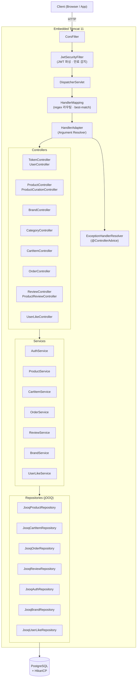

# Fitory Backend

패션 이커머스 플랫폼 **Fitory**의 백엔드 서버입니다. 자체 제작한 경량 프레임워크 **Xpring** 위에서 동작하며, 상품 관리·장바구니·주문·리뷰·브랜드·카테고리·좋아요 등 핵심 도메인을 제공합니다.

---

## Architecture



### Request 흐름

| 단계 | 구성요소 | 역할 |
|------|----------|------|
| 1 | CorsFilter | CORS preflight 처리, 허용 Origin 검증 |
| 2 | JwtSecurityFilter | `Authorization` 헤더에서 JWT 파싱, 만료 시 `TOKEN_EXPIRED` attribute 세팅 |
| 3 | DispatcherServlet | 요청 수신, 전체 흐름 조율 |
| 4 | HandlerMapping | 정규식 패턴으로 핸들러 탐색 (경로변수 최소 우선) |
| 5 | HandlerAdapter | `@RequestBody` · `@PathVariable` · `@RequestParam` · `@CurrentUser` 주입 |
| 6 | Controller → Service → Repository | 비즈니스 로직 수행 |
| 7 | ExceptionHandlerResolver | `@ControllerAdvice` 기반 전역 예외 처리 |

---

## Tech Stack

| 영역 | 기술 | 버전 |
|------|------|------|
| 언어 | Java | 21 |
| 웹 프레임워크 | Xpring (자체 제작) | local module |
| 웹 서버 | Embedded Tomcat | 11.0.12 |
| SQL 빌더 | jOOQ | 3.20.15 |
| DB | PostgreSQL | 42.7.11 (JDBC) |
| 커넥션풀 | HikariCP | 7.0.2 |
| 인증 | JJWT | 0.11.5 |
| 비밀번호 | jBCrypt | 0.4 |
| JSON | Jackson Databind | 3.1.2 |
| 로깅 | SLF4J + Logback | 2.0.13 / 1.5.6 |
| 빌드 | Gradle Shadow JAR | 8.1.1 |
| 테스트 | JUnit 5 | 5.10.0 |
| CI/CD | GitHub Actions | - |
| 배포 | Render | - |

---

## Project Structure

```
backend/
├── src/main/java/org/fitory/
│   ├── auth/           # 인증 (로그인 · 회원가입)
│   ├── brand/          # 브랜드
│   ├── cart/           # 장바구니
│   ├── category/       # 카테고리
│   ├── common/dto/     # PageResponse (공통 페이지네이션)
│   ├── exception/      # GlobalExceptionHandler, ErrorCode
│   ├── order/          # 주문
│   ├── product/        # 상품 + 큐레이션
│   ├── review/         # 리뷰
│   ├── security/       # JwtProvider, JwtSecurityFilter, BCryptPasswordEncoder
│   ├── user/           # 유저 프로필
│   └── userlike/       # 좋아요(위시리스트)
├── src/main/resources/
│   ├── application.yml
│   └── migration/
│       └── V1__add_indexes.sql
└── xpring/             # 경량 MVC 프레임워크 모듈
    └── src/main/java/
        ├── boot/       # ApplicationContext 부트스트랩
        ├── core/       # IoC 컨테이너, ComponentScanner, @Component
        ├── mvc/        # DispatcherServlet, HandlerMapping, HandlerAdapter
        ├── log/        # Logger 추상화
        └── security/   # SecurityContextHolder, @CurrentUser
```

---

## API Documentation

> 인증이 필요한 엔드포인트는 `Authorization: Bearer <token>` 헤더가 필요합니다.

### Auth

#### `POST /api/tokens` — 로그인

**Request Body**
```json
{ "email": "user@example.com", "password": "password" }
```

**Response `200`**
```json
{ "accessToken": "<base64-encoded JWT>" }
```

---

#### `POST /api/users` — 회원가입

**Request Body**
```json
{ "email": "user@example.com", "password": "password", "name": "홍길동" }
```

**Response `201`**
```json
{ "id": 1, "email": "user@example.com", "name": "홍길동" }
```

---

#### `GET /api/users/me` — 내 정보 조회 `🔒`

**Response `200`**
```json
{
  "id": 1,
  "email": "user@example.com",
  "name": "홍길동",
  "role": "USER",
  "createdAt": "2024-01-01T00:00:00"
}
```

---

### Products

#### `GET /api/products` — 전체 상품 목록

**Response `200`** `List<ProductResponse>`

---

#### `GET /api/products/search` — 상품 검색

| 파라미터 | 타입 | 설명 |
|----------|------|------|
| `category` | string | 카테고리 slug (예: `outer`) |
| `brand` | string | 브랜드명 (예: `KSUBI`) |
| `keyword` | string | 상품명 검색어 (LIKE) |
| `page` | int | 페이지 번호 (기본값: `0`) |
| `size` | int | 페이지 크기 (기본값: `20`) |

**Response `200`**
```json
{
  "content": [ /* ProductResponse[] */ ],
  "page": 0,
  "size": 20,
  "totalElements": 42,
  "totalPages": 3,
  "hasNext": true,
  "hasPrevious": false
}
```

---

#### `GET /api/products/new-arrivals` — 신상품 목록

**Response `200`** `List<ProductResponse>`

---

#### `GET /api/products/ranks` — 인기 상품 목록

**Response `200`** `List<ProductResponse>`

---

#### `GET /api/products/{id}` — 상품 상세

**Response `200`**
```json
{
  "id": 1,
  "name": "레더 재킷",
  "brandName": "KSUBI",
  "categorySlug": "outer",
  "price": 450000,
  "salePrice": 360000,
  "discountRate": 20,
  "stock": 5,
  "imageUrl": "https://..."
}
```

---

#### `POST /api/products` — 상품 등록

**Request Body** `CreateProductRequest`

**Response `201`** `ProductResponse`

---

#### `PUT /api/products/{id}` — 상품 수정

**Request Body** `UpdateProductRequest`

**Response `200`** `ProductResponse`

---

#### `DELETE /api/products/{id}` — 상품 삭제 (soft delete)

**Response `204`**

---

#### `GET /api/products/{productId}/reviews` — 상품별 리뷰

| 파라미터 | 기본값 |
|----------|--------|
| `page` | `0` |
| `size` | `10` |

**Response `200`** `PageResponse<ReviewResponse>`

---

### Brands

#### `GET /api/brands` — 브랜드 목록

**Response `200`** `List<BrandResponse>`

---

#### `GET /api/brands/{id}` — 브랜드 상세

**Response `200`** `BrandResponse`

---

#### `GET /api/brands/{id}/products` — 브랜드별 상품

| 파라미터 | 기본값 |
|----------|--------|
| `page` | `0` |
| `size` | `10` |

**Response `200`** `PageResponse<ProductResponse>`

---

#### `POST /api/brands` — 브랜드 등록

**Request Body** `CreateBrandRequest`

**Response `201`** `BrandResponse`

---

#### `PUT /api/brands/{id}` — 브랜드 수정

**Request Body** `UpdateBrandRequest`

**Response `200`** `BrandResponse`

---

#### `DELETE /api/brands/{id}` — 브랜드 삭제

**Response `204`**

---

### Categories

#### `GET /api/categories` — 카테고리 목록

**Response `200`** `List<CategoryResponse>`

---

### Cart

모든 장바구니 엔드포인트는 인증이 필요합니다 (`🔒`).

#### `GET /api/carts` — 장바구니 조회 `🔒`

| 파라미터 | 기본값 |
|----------|--------|
| `page` | `0` |
| `size` | `10` |

**Response `200`**
```json
{
  "content": [
    {
      "product": { /* ProductResponse */ },
      "quantity": 2,
      "createdAt": "2024-01-01 12:00:00",
      "updatedAt": "2024-01-02 09:30:00"
    }
  ],
  "page": 0,
  "size": 10,
  "totalElements": 3,
  "totalPages": 1,
  "hasNext": false,
  "hasPrevious": false
}
```

---

#### `POST /api/carts` — 장바구니 담기 `🔒`

**Request Body**
```json
{ "productId": 1, "quantity": 2 }
```

**Response `201`** `CartItemResponse`

---

#### `PATCH /api/carts/{id}` — 수량 변경 `🔒`

**Request Body**
```json
{ "quantity": 3 }
```

**Response `200`** `CartItemResponse`

---

#### `DELETE /api/carts/{id}` — 개별 항목 삭제 `🔒`

**Response `204`**

---

#### `DELETE /api/carts` — 장바구니 전체 비우기 `🔒`

**Response `204`**

---

### Orders

#### `GET /api/orders` — 내 주문 목록 `🔒`

**Response `200`** `List<OrderResponse>`

---

#### `GET /api/orders/{orderId}/items` — 주문 상세

**Response `200`** `List<OrderItemResponse>`

---

#### `POST /api/orders` — 주문 생성 `🔒`

**Request Body** `OrderCreateRequest`

**Response `201`** `OrderResponse`

---

### Reviews

#### `GET /api/reviews` — 전체 리뷰

| 파라미터 | 기본값 |
|----------|--------|
| `page` | `0` |
| `size` | `10` |

**Response `200`** `PageResponse<ReviewResponse>`

---

#### `GET /api/reviews/{id}` — 리뷰 상세

**Response `200`** `ReviewResponse`

---

#### `POST /api/reviews` — 리뷰 작성 `🔒`

**Request Body**
```json
{ "productId": 1, "rating": 5, "title": "최고에요", "content": "퀄리티 좋습니다" }
```

**Response `201`** `ReviewResponse`

---

#### `PUT /api/reviews/{id}` — 리뷰 수정 `🔒`

**Request Body** `UpdateReviewRequest`

**Response `200`** `ReviewResponse`

> 작성자 본인이 아닐 경우 `403 Forbidden`

---

#### `DELETE /api/reviews/{id}` — 리뷰 삭제 (soft delete) `🔒`

**Response `204`**

> 작성자 본인이 아닐 경우 `403 Forbidden`

---

### Likes (위시리스트)

#### `GET /api/likes` — 내 좋아요 목록 `🔒`

**Response `200`** `List<UserLikeResponse>`

---

#### `GET /api/likes/products/{productId}` — 상품별 좋아요

**Response `200`** `List<UserLikeResponse>`

---

#### `POST /api/likes` — 좋아요 추가 `🔒`

**Request Body**
```json
{ "productId": 1 }
```

**Response `201`** `UserLikeResponse`

---

#### `DELETE /api/likes?productId={productId}` — 좋아요 취소 `🔒`

**Response `204`**

---

### Error Responses

| HTTP | 상황 |
|------|------|
| `400` | 잘못된 요청 (유효성 검사 실패) |
| `401` | 인증 필요 또는 토큰 만료 |
| `404` | 리소스 없음 |
| `409` | 중복 리소스 (이메일 중복 등) |
| `500` | 서버 내부 오류 |

**Error Body**
```json
{ "code": "UNAUTHORIZED", "message": "인증이 필요합니다." }
```

---

## Environment Variables

| 변수 | 설명 | 예시 |
|------|------|------|
| `DATABASE_URL` | PostgreSQL JDBC URL | `jdbc:postgresql://host:5432/fitory` |
| `DATABASE_USERNAME` | DB 사용자명 | `postgres` |
| `DATABASE_PASSWORD` | DB 비밀번호 | `yourpassword` |
| `JWT_SECRET_KEY` | JWT 서명 키 (Base64, 32바이트 이상) | `c2VjcmV0...` |
| `CORS` | 허용할 프론트엔드 Origin | `http://localhost:3000` |

---

## Build & Run

### 요구사항

- Java 21+
- PostgreSQL 15+

### 빌드

```bash
./gradlew shadowJar
```

`build/libs/fitory.jar` 가 생성됩니다.

### 로컬 실행

```bash
export DATABASE_URL=jdbc:postgresql://localhost:5432/fitory
export DATABASE_USERNAME=postgres
export DATABASE_PASSWORD=yourpassword
export JWT_SECRET_KEY=your-base64-encoded-secret-key
export CORS=http://localhost:3000

java -jar build/libs/fitory.jar
```

서버가 `http://localhost:8080` 에서 시작됩니다.

### Docker

```bash
docker build -t fitory-backend:latest .

docker run -p 8080:8080 \
  -e DATABASE_URL=jdbc:postgresql://db:5432/fitory \
  -e DATABASE_USERNAME=postgres \
  -e DATABASE_PASSWORD=yourpassword \
  -e JWT_SECRET_KEY=your-base64-encoded-secret-key \
  -e CORS=http://localhost:3000 \
  fitory-backend:latest
```

---

## Database

PostgreSQL을 사용하며, `pg_trgm` 확장을 활성화해야 상품명 키워드 검색이 동작합니다.

```sql
CREATE EXTENSION IF NOT EXISTS pg_trgm;
```

인덱스 마이그레이션은 `src/main/resources/migration/V1__add_indexes.sql` 를 참고하세요.

### 주요 테이블

| 테이블 | 설명 |
|--------|------|
| `users` | 회원 계정 |
| `brands` | 브랜드 |
| `categories` | 카테고리 (slug 기반) |
| `products` | 상품 카탈로그 (soft delete) |
| `cart_items` | 장바구니 |
| `orders` / `order_items` | 주문 |
| `reviews` | 리뷰 (soft delete) |
| `users_likes` | 좋아요 |
| `new_arrivals` / `ranked_products` | 큐레이션 |

---

## CI / CD

| 이벤트 | 동작 |
|--------|------|
| `v*` 태그 푸시 | Render 배포 웹훅 호출 (`RENDER_DEPLOY_URL` secret) |

```bash
# 배포 예시
git tag v1.0.0
git push origin v1.0.0
```

---

## Xpring Framework

`xpring/` 서브모듈은 Spring 없이 직접 구현한 경량 MVC 프레임워크입니다.

| 기능 | 클래스 |
|------|--------|
| IoC 컨테이너 | `BeanFactory`, `ComponentScanner` |
| 라우팅 | `HandlerMapping` (정규식 기반, 숫자형 경로변수 `\d+` 컴파일) |
| 인자 주입 | `HandlerAdapter` (PathVariable, RequestBody, RequestParam, CurrentUser) |
| 전역 예외 처리 | `ExceptionHandlerResolver` (@ControllerAdvice) |
| 보안 컨텍스트 | `SecurityContextHolder` (ThreadLocal) |
| 로깅 | `XpringLoggerFactory` (SLF4J 래퍼) |
